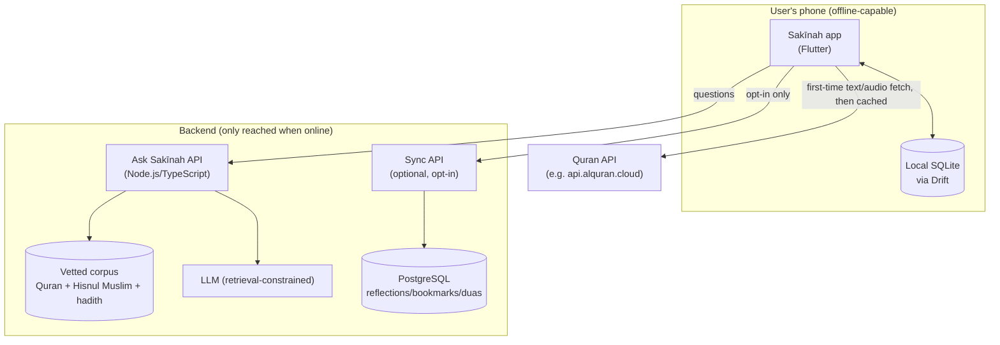
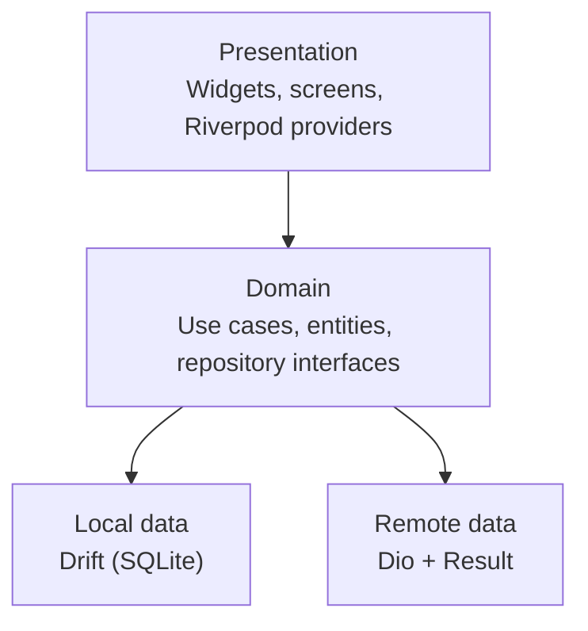
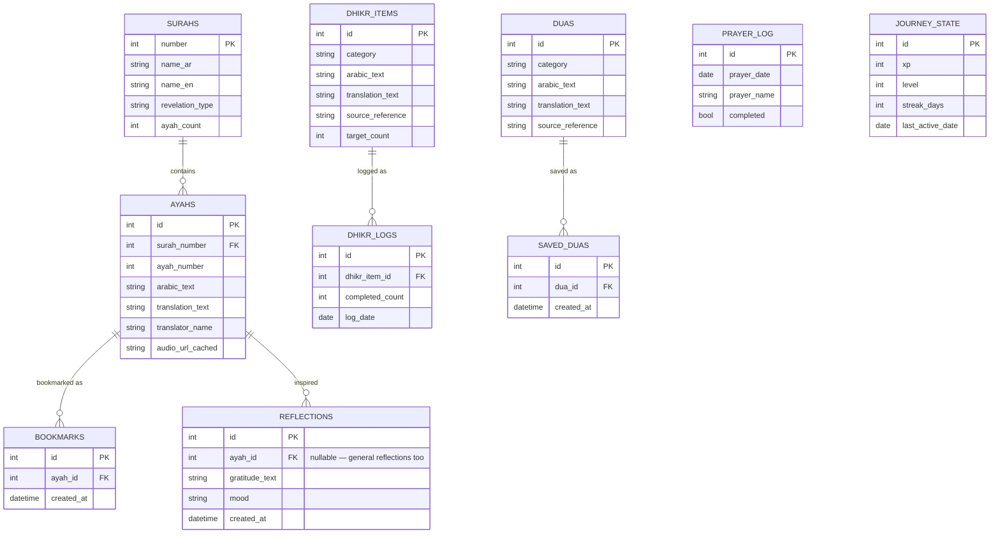
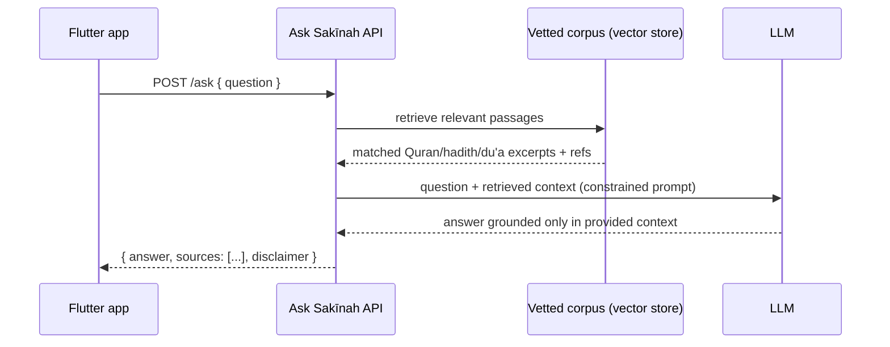

# Sakīnah — System Design

**Stack decision (locked in):** Flutter (mobile) + Node.js/TypeScript (backend). Rationale is in `sakinah-research-and-decisions.md` — summary: the app's core is complex Arabic/Quranic text rendering and true offline-first storage, and Flutter + Drift beats React Native / native-split / KMP on both of those specifically for a one-person team.

---

## 1. Goals & non-functional requirements

- **Offline-first**: prayer times, Quran text/audio (once cached), dhikr counters, bookmarks, reflections, and journey progress must work with zero connectivity.
- **Content integrity**: no religious text (Quran, hadith, du'a) may ever be invented or paraphrased from memory — every piece must carry a real source, or render as an explicit placeholder.
- **RTL + dark mode** are first-class, not an afterthought bolted onto an English-first layout.
- **Calm performance**: 60fps scrolling on the Quran reader and audio player; no jank from the tasbeeh counter or garden animations.
- Single developer/small team — favor fewer moving parts over theoretical scalability.

---

## 2. High-level system diagram



Everything inside the phone works with the network off. Only two things ever leave the device: an Ask Sakīnah question, and — only if the user turns on the Settings → Cloud sync toggle — reflections/bookmarks/duas for cross-device sync.

---

## 3. Mobile app architecture (Flutter)

### 3.1 Layers



- **Presentation** never touches Drift or Dio directly — only calls use cases through Riverpod providers. This is what let the 5-tab nav, dark mode, and RTL variants slot in without touching business logic.
- **Domain** is storage-agnostic. Any use case that returns religious text returns a typed object with a mandatory `source` field and a `verified: bool` flag — a screen literally cannot render unsourced Quran/hadith text without it failing to compile or falling into the "unverified — placeholder" render branch.
- **Local data (Drift)** owns almost everything: prayer times (calculated client-side from device location + chosen method — no network call needed), dhikr counters, bookmarks, reflections, saved duas, journey/streak state, and the cached Quran text/audio once downloaded.
- **Remote data (Dio)** is intentionally small: first-time Quran text/audio fetch (then cached forever), Ask Sakīnah calls, and the optional sync calls. Every network call returns `Result<T>` (success/failure), never throws — the UI layer always has a clean error state to render (per the Home "no internet" / "error" states already in the design).

### 3.2 Navigation

`go_router` with a `StatefulShellRoute` for the 5-tab persistent bottom nav (Home / Quran / Dhikr / Journey / Profile — confirmed decision from earlier, matching the real repo). Sub-screens (Surah details, Reader, Settings, Du'a detail, etc.) push on top of the active tab's stack, so switching tabs preserves each tab's scroll/navigation position.

### 3.3 State management

Riverpod providers per feature (`prayerTimesProvider`, `quranReaderProvider`, `dhikrProgressProvider`, etc.), each backed by a use case from the domain layer. Providers expose `AsyncValue<T>` so every screen naturally has loading/data/error states — matching the skeleton/empty/error states already designed.

### 3.4 Background work

- Prayer-time notifications scheduled locally (no server round-trip needed once the day's times are calculated) via platform-native scheduled notifications.
- Quran audio downloads run as a background task with progress reported back into Drift, so the mini-player can show download state even if the app is backgrounded mid-download.

---

## 4. Local data model (Drift / SQLite)



Every table that carries religious text (`AYAHS`, `DHIKR_ITEMS`, `DUAS`) has a mandatory `source_reference`/`translator_name` column — enforced at the schema level, not just convention, so unsourced content can't be inserted in the first place.

---

## 5. Backend: Ask Sakīnah service

**Stack**: Node.js + TypeScript + Express, Dockerized, stateless (no session storage needed).

### 5.1 Request flow



Critically: the LLM is **never** given open-web access or asked to answer from its own training knowledge — only from the passages retrieved in step 2. If retrieval finds nothing relevant, the API returns a "couldn't find a grounded answer" response rather than letting the LLM guess.

### 5.2 API contract

```
POST /api/ask
Request:  { "question": string, "language": "ar" | "en" }
Response: {
  "answer": string,
  "sources": [{ "type": "quran" | "hadith", "reference": string }],
  "disclaimer": "For learning purposes. For personal religious rulings, consult a qualified scholar."
}
```

The service refuses to answer anything that reads as a request for a personal fatwa/ruling — those get redirected to the same "consult a qualified scholar" language rather than an attempted answer.

### 5.3 Corpus ingestion (offline, one-time + periodic)

A separate ingestion pipeline (not user-facing) pulls from:
- A licensed Quran translation API (e.g. api.alquran.cloud), tagged with translator name.
- Hisnul Muslim (Fortress of the Muslim) adhkar/du'a collection.
- A curated, named hadith set (Sahih al-Bukhari / Sahih Muslim references only, no unverified collections).

Each ingested passage is embedded and stored with its exact source citation attached — this citation is what the retrieval step returns and what the API is contractually required to surface with every answer.

---

## 6. Backend: optional cloud sync

Only built if/when multi-device sync is actually wanted — strictly opt-in via the Settings → Cloud sync toggle (already in the design). Local-only stays 100% functional with it off.

- **Stack**: same Node.js/TS service (separate router), PostgreSQL, JWT auth.
- **Scope**: syncs only user-generated data — reflections, bookmarks, saved duas, journey/streak state. Never syncs cached Quran text/audio (redundant — re-downloadable per device) or prayer-time calculations (recompute locally).
- **Conflict resolution**: last-write-wins by `updated_at` timestamp — acceptable given the data (personal notes/bookmarks) has no real concurrent-edit scenario for a single user across devices.

---

## 7. Deployment

- Ask Sakīnah service + (optional) sync service: two small Docker containers behind a reverse proxy, deployable on any $5–10/mo VPS or a serverless container platform — no need for heavier infra given expected load (single-app, not high-traffic SaaS).
- Corpus ingestion pipeline runs as a scheduled job (cron/GitHub Action), not part of the live request path.

---

## 8. What this locks in vs. what's still open

**Locked in by this document:**
- Flutter mobile, Node/TS backend, Drift local storage, retrieval-constrained Ask Sakīnah.
- Schema-level enforcement of sourced religious content.
- Offline-first as the default; network only for Ask Sakīnah, first-time Quran fetch, and opt-in sync.

**Still open (needs your call before implementation starts):**
1. Which Quran translation API / license to use, and which named translation(s) to ship by default.
2. Vector store choice for the Ask Sakīnah corpus (e.g. pgvector inside the same Postgres instance vs. a dedicated vector DB) — pgvector is the simpler default for this scale.
3. Whether cloud sync is built now or deferred to a later phase — it's the only piece of this design with real recurring hosting cost.